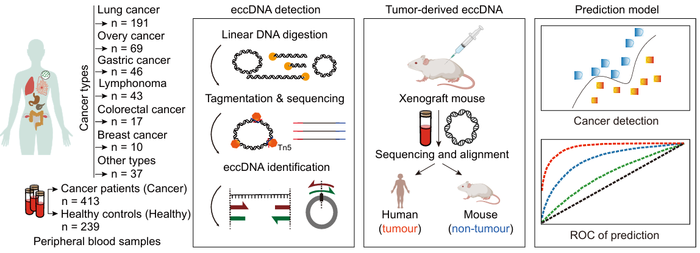

# ScanTecc — Cell-Free eccDNA Cancer Detection Pipeline

Documentation for the data and code from:

> Fang et al. "Detection of primary cancer types via fragment size selection in circulating cell-free extrachromosomal circular DNA." *Genome Medicine* 18, 18 (2026). https://doi.org/10.1186/s13073-025-01595-6



---

## Project Structure

```
ScanTecc/
├── scantecc_eccDNA_identification_pipeline/
│   ├── efp_parallel.py          # Multi-process eccDNA junction detection from BAM files
│   ├── parser.py                # BAM parsing utilities and CIGAR-based segment class
│   └── genomic_interval.py     # Interval arithmetic library (union, intersection, difference)
│
├── Figure1_normalized_cell-free_eccDNA_counts_visualization.ipynb   # Fig 1C
├── Figure1_cell-free_eccDNA_size_distribution.ipynb                 # Fig 1D, 1E
├── Figure1_genomic_feature_enrichment.ipynb                         # Fig 1G
├── Figure2_size_selection_analysis.ipynb                            # Fig 2A, 2B
├── Figure2_gene_visualization.ipynb                                 # Fig 2C
├── Figure2_gene_pattern.ipynb                                       # Fig 2D
├── Figure3_cancer_detection_analysis.ipynb                          # Fig 3A, 3C, 3D
├── Figure3_RandomForest_tissue-of-origin_analysis.py                # Fig 3B
│
├── Sfigure1_RCA_comparasion_analysis.ipynb                          # Suppl. Fig S1C, S1D
├── Sfigure2_Size_distribution_density_analysis.ipynb                # Suppl. Fig S2/S3
├── Sfigure3_gene_density_correlation_analysis.ipynb                 # Suppl. Fig S4
├── sequence_compare.ipynb                                           # Breakpoint sequence analysis
│
└── AdditionalData/
    ├── 13073_2025_1595_MOESM1_ESM.docx   # Supplementary figures S1–S11
    └── 13073_2025_1595_MOESM2_ESM.xlsx   # Supplementary tables S1–S5
```

---

## Supplementary Data Files

### `AdditionalData/13073_2025_1595_MOESM2_ESM.xlsx` — Supplementary Tables S1–S5

| Table | Contents |
|---|---|
| **S1** | Clinical metadata for the primary cohort (413 cancer patients + 239 healthy individuals): sample IDs, age, sex, cancer type, disease stage |
| **S2** | Independent validation cohort (21 lung cancer + 14 healthy): used exclusively for external validation of ScanTecc |
| **S3** | Outward divergent primer sequences used for PCR validation of eccDNA breakpoints |
| **S4** | Per-sample sequencing statistics: total mapped reads, library metrics |
| **S5** | PDX mouse model sample details (N=6 mice) |

**Primary cohort composition:**
- 18 distinct cancer types represented
- 413 cancer patients total, including: Lung (191), Ovarian (69), Gastric (46), Lymphoma (43), Colorectal, Breast, and others
- 239 healthy individuals as controls
- Sequenced on Illumina NovaSeq6000, PE150, ~83 million reads per sample

### `AdditionalData/13073_2025_1595_MOESM1_ESM.docx` — Supplementary Figures S1–S11

Contains extended figures including: cohort inclusion/exclusion criteria flowchart (S1), eccDNA QC and validation panels (S2), EPM comparisons and size distributions (S3), gene density correlation analysis (S4), gene annotation pipeline diagram (S5), TCGA HCNA gene correlation and GSEA (S6), ScanTecc cancer detection ROC curves across stages (S7), independent validation cohort results (S8), holdout generalization analysis (S9), traditional tumor marker comparison CEA/CA19-9 (S10), sex-stratified performance (S11).

---

## Pipeline Code

### `efp_parallel.py` — Parallel eccDNA Junction Detection

**Purpose:** The core bioinformatics script. Detects putative eccDNA fusion junctions (circular back-splice junctions) from a sorted, indexed BAM file using split reads and discordant read pairs. Parallelized across chromosomes using Python `multiprocessing`.

**Usage:**
```bash
python efp_parallel.py <sample.sorted.bam> <num_CPUs> <output.tsv>
```

| Argument | Description |
|---|---|
| `sys.argv[1]` | Path to sorted and indexed BAM file (must contain `SA` tags for split reads) |
| `sys.argv[2]` | Number of CPU cores for parallel processing |
| `sys.argv[3]` | Output TSV file path |

**Algorithm (per chromosome, in parallel):**

1. **Read-pair generation** (`read_pair_generator`): Iterates through the BAM to yield matched read1/read2 pairs, skipping secondary, supplementary, and improper pairs.

2. **Split-read detection** (`countReads`): For each read pair where exactly one read has an `SA` tag (supplementary alignment — the signature of a split read):
   - Extracts all alignment segments from the primary read and its `SA` supplementary records.
   - Sorts segments by read coordinate.
   - Identifies a **back-junction** when a later segment maps to a genomically earlier position than the previous one (the hallmark of a circular DNA read-through).
   - Records the junction as `chr:fusion_left:fusion_right`.

3. **Local read counting** (`count`): For each detected junction coordinate, counts:
   - **Linear reads**: reads spanning the position continuously (evidence against a break)
   - **Circular reads**: reads not spanning continuously (evidence for a junction)
   - **Same-strand / different-strand mate pairs** in the ±5 kb window

4. **Output** (TSV): One row per unique junction candidate.

**Output columns:**

| Column | Description |
|---|---|
| `name` | Junction identifier (`FUSIONJUNC_1`, `FUSIONJUNC_2`, …) |
| `chr` | Chromosome |
| `start` | Left breakpoint coordinate |
| `end` | Right breakpoint coordinate |
| `count` | Number of supporting split read pairs |
| `mate_mapped` | Reference length of the mate read |
| `mate_mapping_quality` | Mapping quality of the mate read |
| `l_mapped` | Bases mapped on the left segment of the split read |
| `r_mapped` | Bases mapped on the right segment of the split read |
| `left_linear_reads` | Linear reads crossing the left breakpoint |
| `left_circ_reads` | Non-linear reads at the left breakpoint |
| `left_mate_ss` | Same-strand mates near the left breakpoint |
| `left_mate_ds` | Different-strand mates near the left breakpoint |
| `right_linear_reads` | Linear reads crossing the right breakpoint |
| `right_circ_reads` | Non-linear reads at the right breakpoint |
| `right_mate_ss` | Same-strand mates near the right breakpoint |
| `right_mate_ds` | Different-strand mates near the right breakpoint |

**Requirements:** Python 3.7+, `pysam`, `multiprocessing`; BAM must be sorted, indexed, and aligned with split-read support (`SA` tags — produced by BWA MEM with default settings).

---

### `parser.py` — BAM Parsing Utilities

Provides two classes/functions used by `efp_parallel.py`:

**`Segment` class** (modified from [`brentp/cigar`](https://github.com/brentp/cigar)):
- Parses a CIGAR string and a reference start position to compute:
  - `ref_start`, `ref_end`: coordinates of the alignment on the reference
  - `read_start`, `read_end`: coordinates within the query read
- Handles `M` (match/mismatch), `I` (insertion), `D` (deletion), and `S` (soft-clip) CIGAR operations.
- Used to interpret each supplementary alignment record from the `SA` tag.

**`parse_fusion_bam(bam_f, pair_flag)`**:
- Reads a BAM file and yields read pairs at fusion junctions identified by the `XF` tag (inter-splice-site tag from specialized aligners).
- Filters for same-chromosome, same-strand fusions.
- Used for an alternative fusion-detection mode (requires `XF`/`XP` tags; optional `pair_flag` requires paired-end confirmation via `XP`).

**`parse_ref(ref_file, flag)`**: Parses a gene annotation reference file (tab-separated: gene_id, iso_id, chr, strand, exon starts, exon ends) into `Interval` objects per chromosome.

**`parse_bed(fus)`**: Reads a BED-format fusion file into a per-chromosome dictionary.

**`parse_junc(junc_f, flag)`**: Parses a junction file (e.g., STAR SJ.out.tab format) into dictionaries of junction read counts, with optional left/right junction indexing.

**`check_fasta(fa_f, pysam_flag)`**: Ensures a FASTA file is indexed (`.fai`), creating the index if absent, and returns either a `pysam.FastaFile` object or the file path.

---

### `genomic_interval.py` — Interval Arithmetic Library

Cloned from [`kepbod/interval`](https://github.com/kepbod/interval) by Xiao-Ou Zhang.

**Purpose:** A pure-Python class for performing set operations on genomic intervals. Overlapping intervals are automatically merged on construction into non-redundant, sorted, mutually exclusive intervals. Metadata fields (e.g., gene IDs) attached to each interval are preserved and concatenated on merge.

**`Interval` class — supported operations:**

| Operation | Syntax | Description |
|---|---|---|
| Union | `a + b` or `a += b` | All regions covered by either `a` or `b` |
| Intersection | `a * b` or `a *= b` | Only regions covered by both |
| Difference | `a - b` or `a -= b` | Regions in `a` but not in `b` |
| Complement | `a.complement(sta, end)` | Gaps between intervals, bounded by `sta`–`end` |
| Membership | `[x,y] in a` | True if `[x,y]` overlaps any interval in `a` |
| Extract with | `a.extractwith(b)` | Keep only intervals of `a` that overlap `b` |
| Extract without | `a.extractwithout(b)` | Keep only intervals of `a` that do NOT overlap `b` |
| Map onto | `Interval.mapto(interval, index)` | Map intervals onto an index |
| Overlap with | `Interval.overlapwith(index, interval)` | Find index entries overlapping interval |

Used in `parser.py` to build per-chromosome gene interval indices for overlap queries during annotation.

---

## Analysis Notebooks

### Figure 1 Notebooks

| Notebook | Figure | Description |
|---|---|---|
| `Figure1_normalized_cell-free_eccDNA_counts_visualization.ipynb` | Fig 1C | Bar/strip plots of normalized EPM (eccDNA per million reads) comparing cancer cohorts to healthy individuals across 18 cancer types. Statistical significance via t-test. |
| `Figure1_cell-free_eccDNA_size_distribution.ipynb` | Fig 1D, 1E | Fragment size distribution curves with broken axes; PDX mouse tumor-derived vs. non-tumor-derived eccDNA size comparison showing the ~1,000 bp threshold. |
| `Figure1_genomic_feature_enrichment.ipynb` | Fig 1G | Stacked bar or heatmap of eccDNA distribution across genomic features (exon, intron, intergenic) comparing tumor-derived and non-tumor-derived eccDNA from PDX plasma. |

### Figure 2 Notebooks

| Notebook | Figure | Description |
|---|---|---|
| `Figure2_size_selection_analysis.ipynb` | Fig 2A, 2B | EPM plots after in silico size selection (>1,000 bp); fold-change comparison before/after size selection showing enrichment of tumor signal (1.8× → 3.2×). Mann-Whitney-Wilcoxon and t-tests. |
| `Figure2_gene_visualization.ipynb` | Fig 2C | Gene-level eccDNA enrichment heatmap across cancer types; highlights canonical cancer driver genes (e.g., `MAGEA2`, `BRAT1`, `SHANK3`, `STK35`) enriched in specific tumor types. Reads a `Final_gene_Score_cut.count` gene score matrix. |
| `Figure2_gene_pattern.ipynb` | Fig 2D | Comparison of gene score patterns between large-sized eccDNA and total eccDNA; GSEA-style enrichment showing mitochondrial genes dominate in healthy while tumor genes dominate in cancer. Uses `scanpy` for normalization and differential analysis. |

### Figure 3 Scripts

| Script/Notebook | Figure | Description |
|---|---|---|
| `Figure3_cancer_detection_analysis.ipynb` | Fig 3A, 3C, 3D | ScanTecc cancer detection ROC curves stratified by disease stage (I–IV, AUC=0.92–0.93). AdaBoost and Logistic Regression sample-level classification scatter plots at 99% specificity. |
| `Figure3_RandomForest_tissue-of-origin_analysis.py` | Fig 3B | Hyperparameter grid search for Random Forest classifier for tissue-of-origin prediction (4 cancer types + healthy). Uses Wilcoxon-ranked differentially expressed gene features, `scanpy` normalization (log1p + z-score), and exhaustive search over `head`, `p-value cutoff`, `fold change`, normalization type, `n_estimators`, and `random_state`. Outputs per-cancer-type AUC ROC curves as PDF files. Cancer types: Lung, Ovarian, Gastric, Lymphoma. |

### Supplementary Figure Notebooks

| Notebook | Suppl. Figure | Description |
|---|---|---|
| `Sfigure1_RCA_comparasion_analysis.ipynb` | S1C, S1D | Comparison of eccDNA yield and size distribution with vs. without rolling circle amplification (RCA) step; shows RCA biases toward small fragments and reduces large eccDNA recovery. |
| `Sfigure2_Size_distribution_density_analysis.ipynb` | S2, S3 | Genome-wide size distribution density analysis; confirms ~80% of plasma eccDNA is <500 bp with peaks at ~200 bp and ~360 bp. Per-sample size distribution per cancer type. |
| `Sfigure3_gene_density_correlation_analysis.ipynb` | S4 | Linear regression of eccDNA density vs. protein-coding gene density per genomic bin; validates that eccDNA distribution correlates with gene-rich regions in both tumor-derived and non-tumor-derived eccDNA. |
| `sequence_compare.ipynb` | — | Extracts ±20 bp reference sequences around each eccDNA breakpoint from hg19 and computes sequence similarity using `difflib.SequenceMatcher`; used to characterize homologous sequences at junction boundaries and detect microhomology-mediated circularization. |

---

## Biological Context

This repository implements **ScanTecc** (Screening Cancer Types with Cell-free eccDNA), a framework for non-invasive cancer detection using plasma-derived extrachromosomal circular DNA (eccDNA).

**Key biological findings driving the approach:**

1. **Abundance**: Cancer patients have ~2× more plasma eccDNA than healthy individuals (EPM metric), rising to ~3.2× after size selection for fragments >1,000 bp.

2. **Size threshold**: A PDX mouse model (human tumor xenografts in mice) enabled separation of tumor-derived human eccDNA from host mouse eccDNA. Fragments >1,000 bp were found to be predominantly tumor-derived (~30% of tumor eccDNA vs. ~1% of non-tumor eccDNA above this threshold), establishing a biologically motivated size filter.

3. **Gene content**: Large eccDNA (>1,000 bp) from different cancer types carry distinct sets of cancer driver genes (e.g., `MAGEA2` in lung, `SHANK3` in gastric, `BRAT1` in ovarian), enabling tissue-of-origin classification via gene-score features.

4. **Protocol**: Exonuclease V digestion (3 rounds) enriches circular DNA by eliminating linear DNA; the RCA amplification step is deliberately omitted to avoid bias against large fragments.

**ScanTecc model performance:**

| Task | AUC | Notes |
|---|---|---|
| Cancer vs. healthy (all stages) | 0.92 | After >1,000 bp size selection |
| Stage I detection | 0.92 | Comparable to late-stage |
| Stage IV detection | 0.93 | |
| Independent validation (lung) | 0.88 | 21 cancer + 14 healthy |
| Holdout test set | 0.94 | ΔAUC = 0.03 vs. training |
| Tissue-of-origin (overall) | 0.79 | 4 cancer types vs. healthy |
| — Ovarian | 0.81 | Best performing type |
| — Gastric | 0.70 | Lowest performing type |
| AdaBoost @ 99% specificity | 80% sensitivity | 331/413 cancers detected |
| Logistic Regression @ 99% specificity | 82% sensitivity | 338/413 cancers detected |
